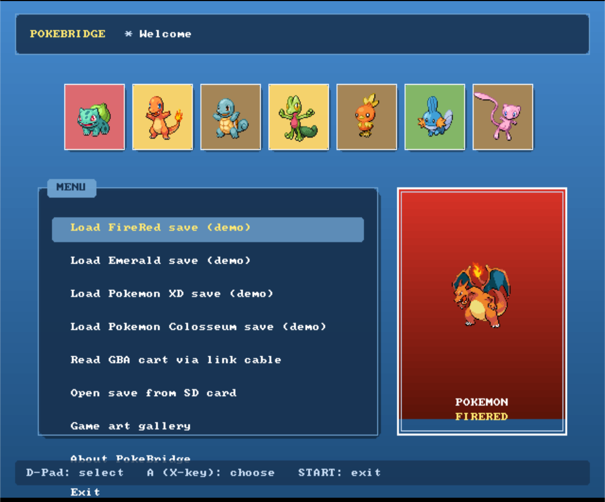
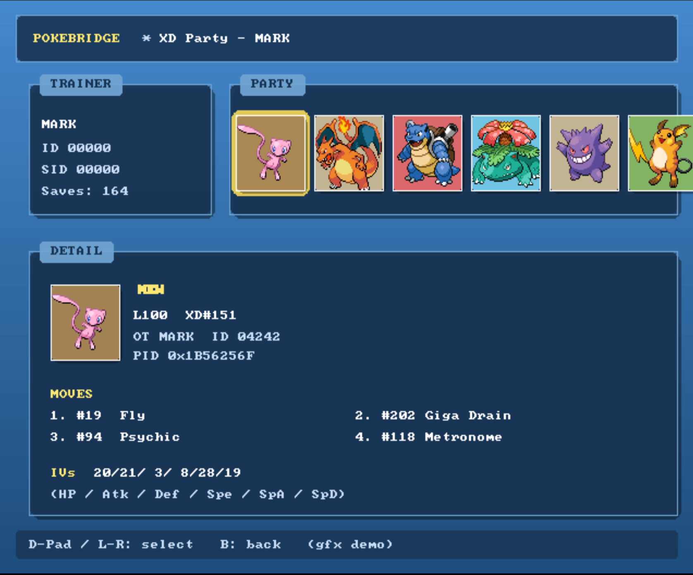
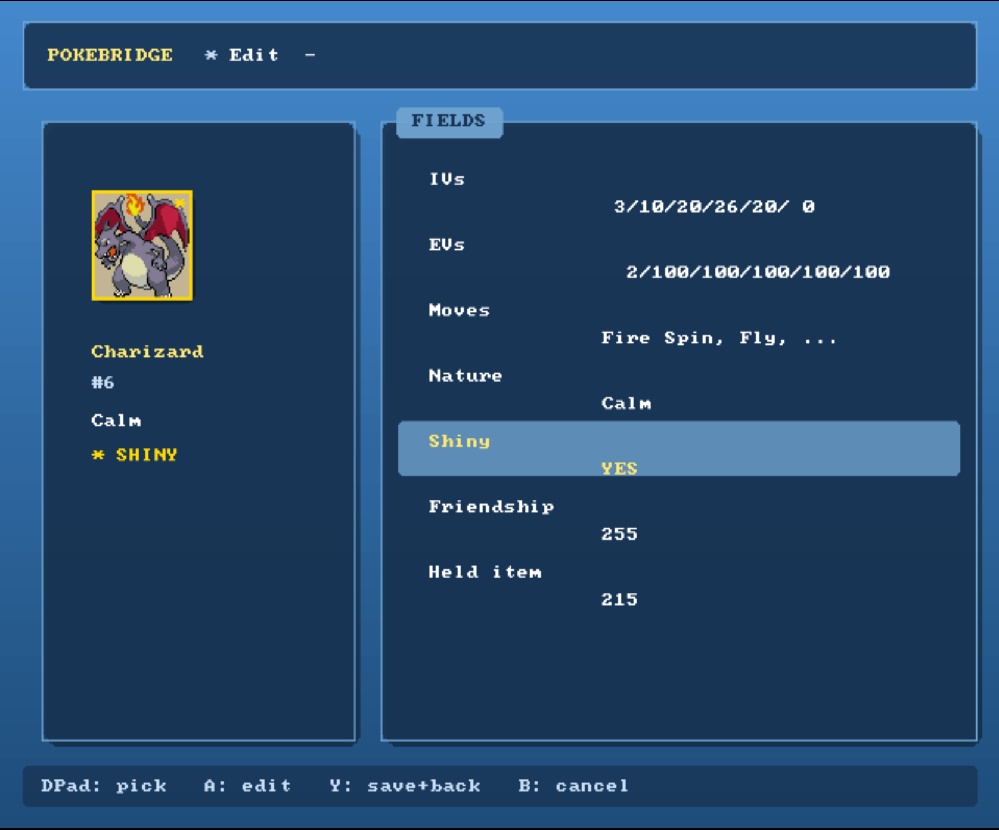
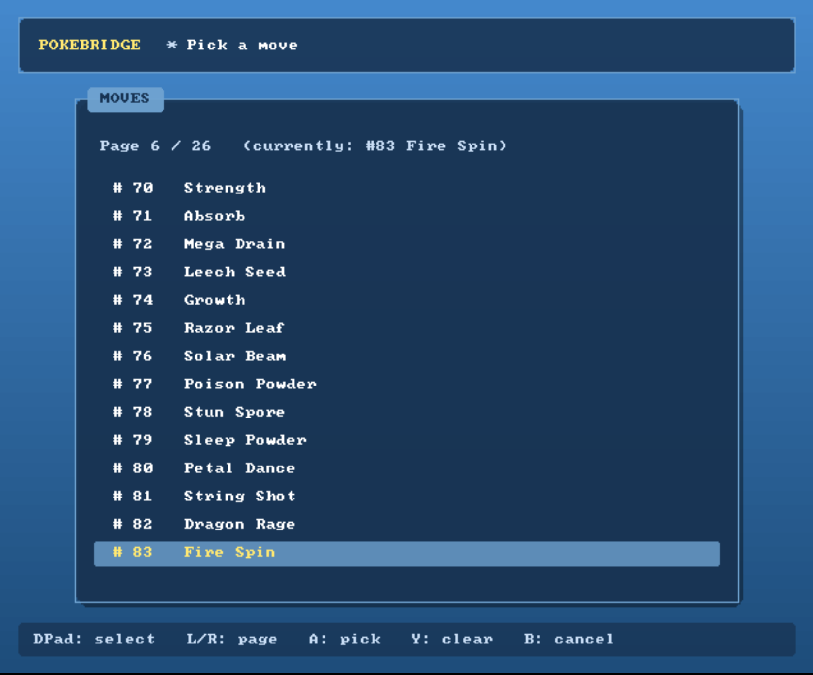
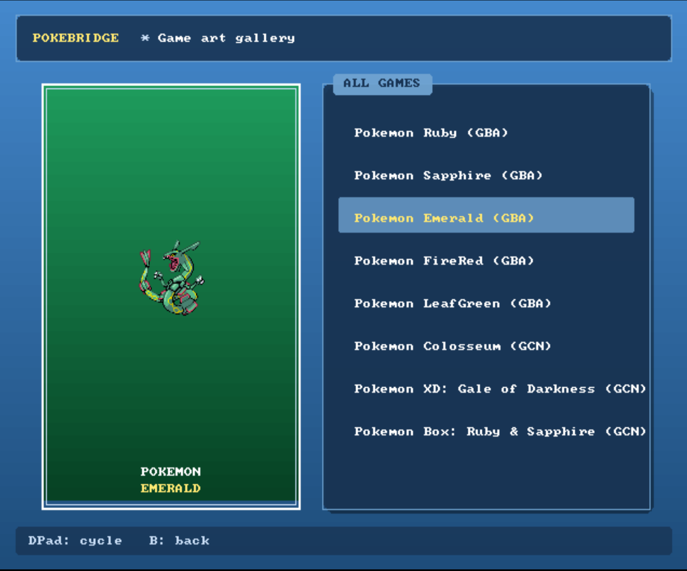

# PokéBridge

A **GameCube homebrew app** for reading, editing, and exporting Pokémon Gen 3 saves — covering Ruby, Sapphire, Emerald, FireRed, LeafGreen, **all pokeemerald-expansion ROM hacks** (Seaglass, Lazarus, etc.), and the two Gen 3 GameCube titles **Pokémon XD: Gale of Darkness** and **Pokémon Colosseum**.

The interface is fully graphical with a Pokémon Box: Ruby & Sapphire aesthetic — pastel-blue gradient backgrounds, rounded translucent panels, real Gen 3-style sprites for **all 1025 species + shiny variants**, and box-art previews for every mainstream Gen 3-era game.

## What it does

- **Read** Gen 3 GBA `.sav` files (128 KB) directly from SD card via Swiss
- **Read** Pokémon XD `.gci` files (encrypted with GeniusCrypto)
- **Read** Pokémon Colosseum `.gci` files (encrypted with SHA-1 chain XOR)
- **Scan a physical GameCube memory card** for XD / Colosseum / Pokémon Box saves and load them directly (no need to extract to SD first)
- **Edit** any Pokémon: IVs, EVs, moves, nature, shiny toggle, friendship, held item
  - Shiny toggle preserves nature via PID re-rolling; nature edit preserves shiny status
  - Sprites swap to the shiny variant live in the preview
- **Write** edited saves back to SD with correct checksums + encryption for the source format
- **Legalize** ROM-hack Pokémon into Gen 3-compatible `.pk3` files for the Pokémon HOME transfer chain (species/move remap for the standard pokeemerald-expansion enum)
- **Read GBA cart saves over the link cable** by multiboot-loading FIX94's dumper onto a connected GBA (untested — needs hardware verification)

## Screenshots

### Main menu — game-themed box art previews



### XD party browser — MARK's iconic team, with detail panel



### Editor — live shiny sprite swap



### Move picker — full 354 Gen 3 moves, paged



### Game Art Gallery — every mainstream Gen 3-era title



## Quick start

### Build prerequisites

- **devkitPPC** with libogc, libfat-ogc, SDL2, SDL2_test
- **devkitARM** (to build the GBA-side dumper ROM)
- **Python 3** with Pillow (`pip install pillow`) for sprite conversion
- macOS, Linux, or WSL

Install via `dkp-pacman`:

```bash
sudo dkp-pacman -S --needed gamecube-dev gamecube-sdl2 gba-dev
```

### Clone + set up assets

```bash
git clone https://github.com/<you>/pokebridge.git
cd pokebridge
./scripts/setup_assets.sh
```

The setup script:
1. Sparse-clones `pokeemerald-expansion` (for the 1025-species sprite set)
2. Clones `FIX94/gba-link-cable-dumper`, builds the GBA-side multiboot ROM
3. Generates `include/embedded_sprites.h` (~2 MB, 4bpp + palette) covering all 1025 species + shiny
4. Generates `include/embedded_gba_mb.h` (60 KB) from the dumper ROM
5. Creates stub `embedded_*save.h` files (empty placeholders for the optional demo saves)

### Build

```bash
make
```

Produces `pokebridge.dol` (~3 MB without demo saves, larger if you embed your own).

### Install on GameCube

Copy to your Swiss-formatted SD card:

```
sd:/apps/pokebridge/boot.dol     ← rename pokebridge.dol to boot.dol
sd:/pokebridge/saves/            ← drop your .sav / .gci / .gcs files here
sd:/pokebridge/export/           ← legalized .pk3 files land here
```

Boot via Swiss → `sd:/apps/pokebridge/boot.dol`. The graphics menu loads directly.

### Wii / Wii U compatibility

Works on a **homebrew-enabled Wii running in GameCube mode** (Nintendont, Swiss-r, or the disc-channel GameCube backwards-compat on the original Wii). The Wii's two GameCube memory card slots are exposed as slot A / slot B just like on a real GameCube, so the "Scan GameCube memory card" feature picks up XD / Colosseum / Pokémon Box saves there too.

What does **not** work:
- Wii U vWii (no native GameCube hardware exposed)
- Wii in Wii-mode SD slot for GC memcards (PokéBridge runs as a GC homebrew, so it sees GC slots only)
- Wii without GameCube ports (the family-edition / later "Wii Mini" hardware revisions)

## Optional: embed your own demo saves

If you want save files baked into the `.dol` (so they work without an SD card — handy for Dolphin testing), drop them into the `data/` folder and run:

```bash
python3 tools/embed_save.py firered  data/my_firered.sav
python3 tools/embed_save.py emerald  data/my_emerald.sav
python3 tools/embed_save.py xd       data/my_pokemon_xd.gci
python3 tools/embed_save.py colo     data/my_pokemon_colosseum.gcs
make
```

Each command writes `include/embedded_<kind>_save.h` which the build picks up automatically.

**Note:** the `embedded_*save.h` files are gitignored — don't commit them. They contain user save data which is technically copyrighted.

## Optional: embed background music

A WAV dropped into `data/` and embedded via `embed_audio.py` will loop in the background while the app runs (uses libaesnd, gapless via `AESND_SetVoiceLoop`).

```bash
python3 tools/embed_audio.py title data/your_song.wav
make
```

Requirements:
- 16-bit PCM WAV (mono preferred, smaller .dol; stereo works too — change the format constant in `pb_audio.c`)
- The tool byte-swaps to BE at embed time (GameCube DSP is BE-native)
- Anything up to a few MB is fine — bigger samples make the `.dol` bigger, that's all

`include/embedded_title_audio.h` is gitignored. Without it, `setup_assets.sh` writes a silent stub and the app boots without music.

## How it works

PokéBridge is several modular pieces:

### Save parsers

- **`source/save.c`** — Gen 3 GBA save: 14 sections of 4096 bytes per slot, latest-slot detection by save_index, full Trainer Info + Team/Items + PC Storage layout. Little-endian throughout.
- **`source/pokemon.c`** — Gen 3 Pokémon: 80-byte boxed format with PID/OT-XOR encryption and 24-permutation substructure shuffle. Verified byte-for-byte against PKHeX's `BlockPosition` table.
- **`source/pb_xd.c`** + **`source/genius_crypto.c`** — Pokémon XD: `SAV3XD` slot layout + GeniusCrypto stream cipher (4 BE u16 keys, additive). Dynamic sub-offset resolution. CK3 / XK3 (196-byte XD Pokémon).
- **`source/pb_colo.c`** + **`source/sha1.c`** — Pokémon Colosseum: 3-slot save container, SHA-1 chain XOR encryption (digest = inverted at-rest hash, then XOR + re-hash per 20-byte block). CK3 (312-byte Colosseum Pokémon).

All four formats expose a common edit surface via `pb_pkm_t`. Edits write back through format-specific apply functions (`pb_pkm_encode`, `pb_xk3_apply_pkm_edits`, `pb_ck3_apply_pkm_edits`) with checksum recomputation + re-encryption as appropriate.

### Legalizer

ROM-hack Pokémon (species ID > 386) are mapped to nearest Gen 3 analogues via a hand-curated table (`include/rom_hack_species_map.h`) — pseudos map to Bagon line, regional starters to Gen 3 starters of matching type, etc. Output is a PKHeX-compatible 80-byte `.pk3` file that rides the legitimate Gen 3 → Pal Park → Gen 4 → Bank → HOME chain (see [docs/HOME_TRANSFER.md](docs/HOME_TRANSFER.md)).

### Graphics

- **SDL2** on devkitPPC's GameCube target. 640×480 framebuffer.
- **Sprite cache** is 2-bank (normal + shiny) keyed by species ID. Sprites are stored 4bpp indexed (16-color palette) and decoded to RGBA on first use, then cached as `SDL_Texture`.
- **Box art** is procedural — gradient panel + cover-species sprite + game name. Eight games: Ruby/Sapphire/Emerald/FireRed/LeafGreen + Colosseum/XD/Pokémon Box: R&S.
- **Editor** is graphics-mode throughout with sub-screens for each field. Shiny re-rolls PID under a nature-preserving constraint; nature edit preserves shiny status.

### GBA link cable

Mirror of FIX94's `gba-link-cable-dumper`. Detects a GBA on a controller port, runs the Nintendo multiboot handshake to upload a 60 KB dumper ROM, then the dumper streams the cart's SRAM back.

**Known issue: internal SI-bus controller mods (BlueRetro, etc.) interfere with the multiboot upload.** Detection works intermittently because the GBA wins some SI probes against the mod's controller emulation, but the sustained ~60 KB multiboot transfer needs every SI exchange to land cleanly, and the mod answering any of them corrupts the CRC and aborts the upload. The GBA ends up sitting on the GAME BOY splash forever (which is actually the correct multiboot-wait state — the bug is upstream).

If you have a BlueRetro or similar internal SI-bus mod:
- The graphics-mode "Joybus debug" screen (hold Z while entering the link-cable menu) will show the response flapping between "device not ready" and "GBA detected!" — that's the smoking gun
- Workaround: swap back to a stock controller board for the dump, or check if your mod's firmware supports a per-port disable
- The Gen 3 / XD / Colosseum SD-card paths are not affected; only the GBA link cable dump is

## Status

| Format | Read | Edit | Write |
|--------|------|------|-------|
| Gen 3 GBA (Ruby/Sapphire/Emerald/FireRed/LeafGreen) | ✅ | ✅ | ✅ |
| pokeemerald-expansion ROM hacks (Seaglass, Lazarus, etc.) | ✅ | ✅ | ✅ |
| Pokémon XD: Gale of Darkness (SD + memcard) | ✅ | ✅ | ✅ |
| Pokémon Colosseum (SD + memcard) | ✅ | ✅ | ✅ |
| GBA cart over link cable | 🟡 ported, blocked by SI-mod hardware | n/a | n/a |
| Pokémon Box: Ruby & Sapphire | 🟡 memcard detection only | ❌ | ❌ |

## Credits

See [CREDITS.md](CREDITS.md). Standing on the shoulders of:
- **PKHeX** by kwsch — save format documentation and algorithm references
- **FIX94's gba-link-cable-dumper** — GBA multiboot + save dump protocol
- **pokeemerald-expansion** by rh-hideout — Gen 3-style sprites for 1025 species
- **devkitPro** — toolchain + libogc + SDL2 port

## License

GPL-3.0. See [LICENSE](LICENSE).

The "Pokémon" name and all species names are trademarks of Nintendo / Game Freak / The Pokémon Company. Nominative use only.
